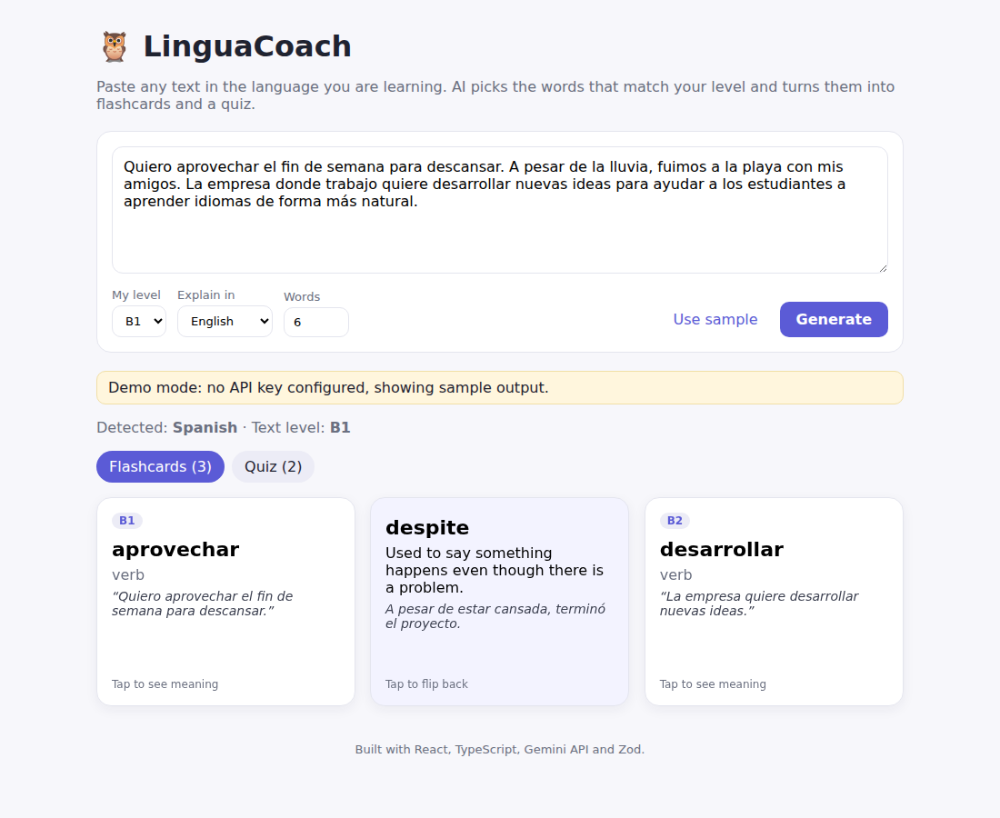
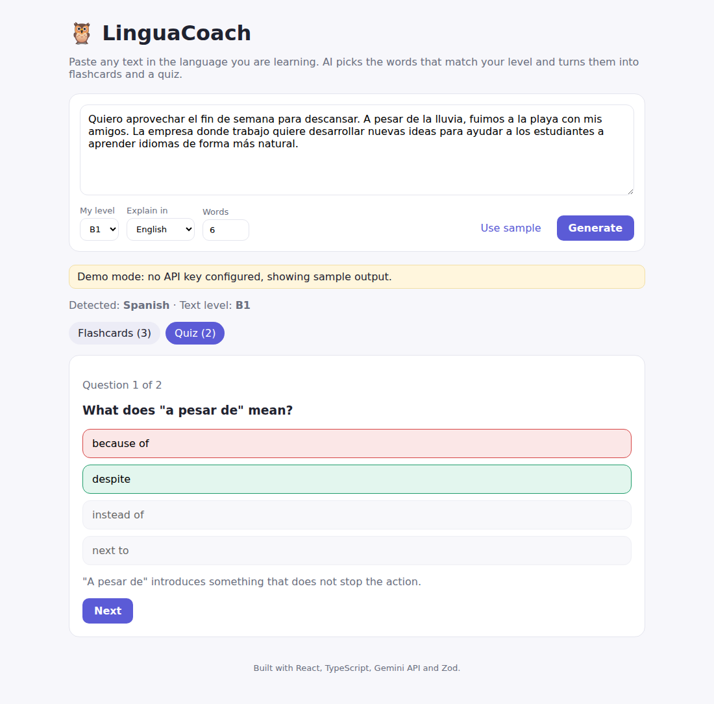

# 🦉 LinguaCoach — AI vocabulary coach

Paste any text in the language you are learning. LinguaCoach picks the words that match your CEFR level and turns them into flashcards and a short quiz.

**Live demo:** https://YOUR-PROJECT.vercel.app




## Why

Learners often read real texts (articles, messages, books) but don't know which new words are worth learning. A tutor would pick the right ones for your level. LinguaCoach does that in seconds and gives you a way to practise them right away.

## How it works

1. The React app sends the text, the learner's level and their native language to `POST /api/generate`.
2. A serverless function (Vercel) builds a prompt and calls the **Gemini API** with JSON output mode. The API key stays on the server.
3. The model's answer is validated with **Zod**. If the JSON doesn't match the schema, the function retries once, otherwise it returns a clear error.
4. The UI shows flip cards (word, level, example from the text → translation, definition, new example) and a multiple-choice quiz with explanations.

```
src/            React + TypeScript UI (flashcards, quiz)
lib/schema.ts   Zod schemas shared by client and server
lib/prompt.ts   Prompt for word selection and quiz generation
lib/core.ts     Validation, LLM call, retry logic
api/generate.ts Vercel serverless function
```

Without an API key the app runs in **demo mode** with sample data.

## Run locally

```bash
npm install
cp .env.example .env    # add GEMINI_API_KEY (free key: https://aistudio.google.com/apikey)
npm run dev             # http://localhost:5173
```

## Deploy

Import the repo in Vercel and add the `GEMINI_API_KEY` environment variable. Vite is detected automatically, and `/api` becomes serverless functions.

## Ideas for next steps

- Spaced repetition: save cards and schedule reviews
- Pronunciation with text-to-speech
- A tutor view: generate a vocabulary set for a lesson from any article
- Evaluate word selection quality on a small labelled set of texts per CEFR level

## Tech

React 18, TypeScript, Vite, Zod, Gemini API, Vercel serverless functions. Built with AI coding agents as part of the workflow.
